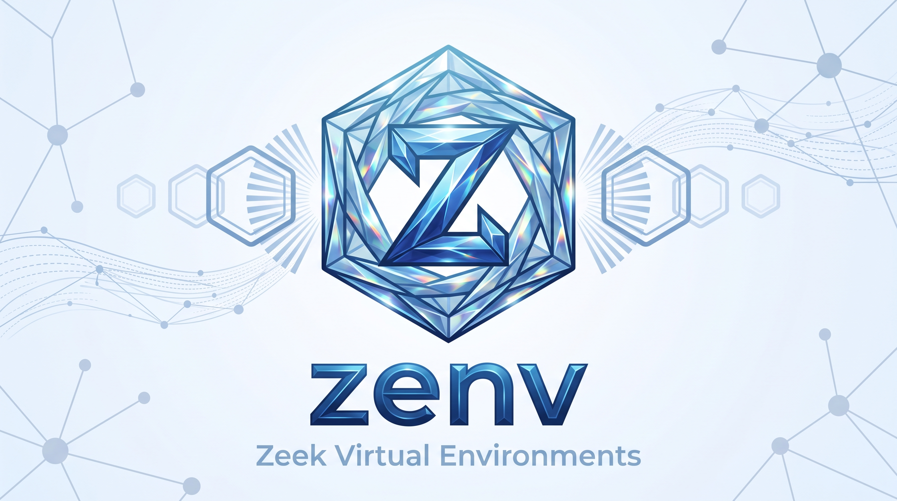

# zenv

Many [Zeek](https://zeek.org) installs side by side, one selected per shell — the way `venv`
does it for Python. Zeek is a network security monitor. Each environment is a self-contained directory holding its own install prefix and
its own zkg state, so a release build, a dev branch and an experiment can coexist instead
of taking turns over one `~/zeek` and one `~/.zkg`.

**zenv never builds Zeek.** It runs no `configure` and no build tool, and it has no opinion
about your build flags. What it does is the bookkeeping around the build: create the
directories, tell you the `--prefix` to install into, wire zkg up afterwards, and set your
shell's environment when you activate.

## Install

```sh
./install.sh
```

That copies `zenv` to `~/.local/bin`, installs the bash and zsh completions, and adds one
marked block to your rc file:

```sh
# >>> zenv >>>
# Added by zenv's install.sh. 'zenv uninstall' removes this block exactly.
case ":$PATH:" in *":$HOME/.local/bin:"*) ;; *) PATH="$HOME/.local/bin:$PATH" ;; esac
eval "$(zenv init sh)"
# <<< zenv <<<
```

Your rc file is copied to `<rcfile>.zenv-pre-install` before the first edit. Open a new
shell, then confirm:

```sh
zenv version
```

`./install.sh --dry-run` says what it would do and changes nothing; `--root DIR` puts
environments somewhere other than `~/zenv`; `--rc FILE` picks the rc file itself, and `--no-rc`
touches none at all.

## Your first environment

Three of the four steps are zenv's. The second is yours, and zenv neither runs nor
inspects it.

```sh
zenv new dev
```

That creates `~/zenv/dev/zeek` (an empty install prefix), `~/zenv/dev/zkg` (an empty zkg
state directory) and the metadata beside them, then prints the prefix.

Now build Zeek however you normally do, installing into that prefix:

<!-- zenv-test: skip build -- this step is yours, and zenv runs no build tool, so tests/test_docs.sh creates an install at that prefix instead of running one -->
```sh
./configure --prefix="$(zenv prefix dev)"
```

The prefix is the whole answer to "which prefix": the environment's own real directory.
Not `~/zeek`, and not another environment's — a Zeek install bakes its prefix in at
configure time, so two environments sharing one prefix report identical script and plugin
paths and their zkg states collide. See
[Why each environment needs its own prefix](docs/USER_GUIDE.md#why-each-environment-needs-its-own-prefix).

Then wire zkg to the install that now exists there, and use it:

```sh
zenv autoconfig dev
zenv activate dev
```

`activate` is shell-local. It touches no symlinks, so a second terminal can hold a
different environment at the same time.

## Switching

```sh
zenv activate default
zenv deactivate
```

Activating another environment removes the previous one's directories from `PATH`,
`PYTHONPATH`, `MANPATH`, `ZEEKPATH` and `ZEEK_PLUGIN_PATH` before adding its own, so
switching leaves no trace of where you came from. `deactivate` restores the shell exactly
as it was, including leaving variables unset that started unset.

## Commands

<!-- zenv-test: table -- generated from `zenv help`; tests/test_docs.sh regenerates it and fails on any difference, so edit the help text rather than the table -->

| Command | What it does |
|---|---|
| `root [--source]` | print the parent directory (and where it came from) |
| `list [--names]` | list environments |
| `prefix [name]` | print an environment's install prefix -- your --prefix |
| `zkgdir [name]` | print an environment's zkg state directory |
| `dist [name]` | print an environment's source tree, only if it verifies |
| `status [name]` | everything about one environment, in one screen |
| `doctor [name]` | diagnose problems (no name: every environment) |
| `version` | print zenv's version |
| `new <name> [--src DIR]` | create an empty environment and print its prefix |
| `adopt <name>` | register an install that already exists |
| `autoconfig [name]` | wire an environment's zkg to the install at its prefix |
| `init [sh\|bash\|zsh]` | emit the shell function; eval "$(zenv init zsh)" |
| `activate <name>` | use an environment in this shell (needs 'init') |
| `deactivate` | restore this shell |
| `exec <name> -- <cmd>` | run one command in an environment without activating |
| `shell activate <name>` | print the shell code 'activate' evaluates |
| `shell deactivate` | print the shell code 'deactivate' evaluates |
| `link <name>` | point ~/zeek and ~/.zkg at an environment |
| `unlink` | remove those two symlinks |
| `remove <name>` | delete an environment (--keep-zkg, --yes, --force) |
| `restore <name>` | undo 'adopt --move': put the install back where it was |
| `uninstall` | remove zenv itself, and say what it leaves behind |

`zenv help` prints the same list with every flag. The five worth reading about before you
use them:

- [`adopt`](docs/USER_GUIDE.md#adopting-an-install-that-already-exists) — bring the
  `~/zeek` and `~/.zkg` you already have under zenv.
- [`autoconfig`](docs/USER_GUIDE.md#zenv-autoconfig) — the post-install step, and the
  safety gate that can refuse.
- [`doctor`](docs/USER_GUIDE.md#zenv-doctor) — every check, and the exit codes.
- [`link`](docs/USER_GUIDE.md#zenv-link-a-system-default) — a system default for shells
  that never activate anything.
- [`uninstall`](docs/USER_GUIDE.md#uninstalling-completely) — what it removes, and the one
  thing it keeps.

## Uninstall

```sh
make uninstall ARGS=--dry-run
```

That prints the whole inventory — every path, with what would happen to it — and changes
nothing. Then, to do it:

```sh
make uninstall ARGS=--yes
```

`./uninstall.sh` and `zenv uninstall` are the same code path with the same flags. An
adopted install is moved back where it came from, and the installs you built yourself are
kept and named, since zenv has nowhere to put them and no business deleting them.

## Requirements

POSIX `sh`, `python3` (already a zkg dependency) and `git`. macOS and Linux. No Zeek source
tree and no Zeek install are needed to install zenv or run its tests.

Something not working? [Troubleshooting](docs/USER_GUIDE.md#troubleshooting) covers the
four that come up: the wrong `zkg` winning, packages that seem to have vanished, a plugin
that will not load, and `zeek` not being found after a `deactivate`.
